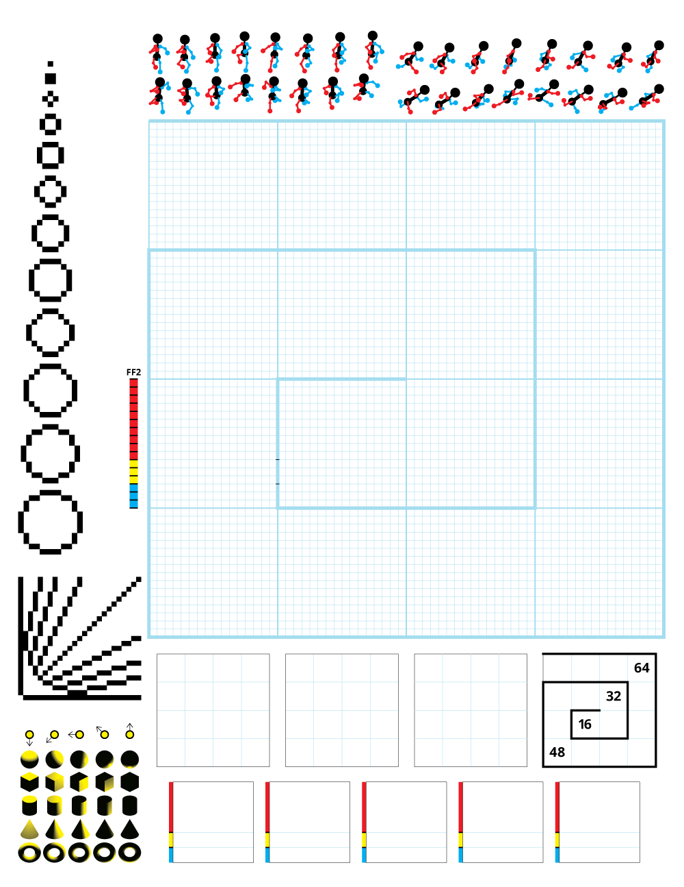
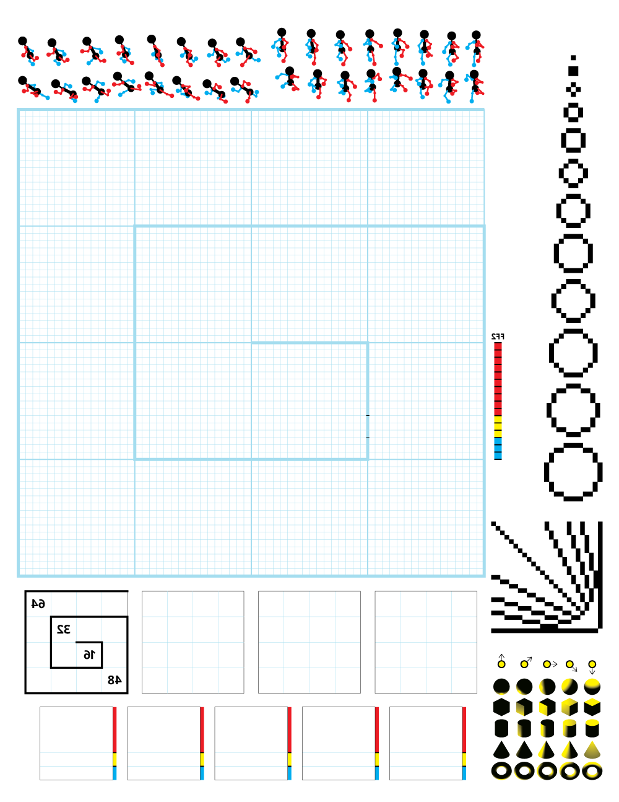

# Pixel pad

Printable pixel grid.

This is a work in progress.

## PDFs

There are two options for printing:

1. Front-side
2. Back-side

Each option has room for spiral binding at the top of the page.

### Front-side print

For opaque paper.

### Back-side print

For vellum paper.

I recommend at least 30 pound vellum paper when using the mirrored version.

## Printing

**Screw Kinkos/FedEx office!** I’m sorry, but they suck.

I’ve had great service at Office Depot Copy & Print shops.

This vellum worked great for my needs:

## Example

To give you an example of what the reverse/vellum print looks like, here’s a show of Pixel Pad “version 1”:

I’ll eventually post an updated image that shows the latest Pixel Pad design.

---

Copyright © 2015 [Micky Hulse](http://mky.io).

Licensed under the Apache License, Version 2.0 (the “License”); you may not use this work except in compliance with the License. You may obtain a copy of the License in the LICENSE file, or at:

[http://www.apache.org/licenses/LICENSE-2.0](http://www.apache.org/licenses/LICENSE-2.0)

Unless required by applicable law or agreed to in writing, software distributed under the License is distributed on an “AS IS” BASIS, WITHOUT WARRANTIES OR CONDITIONS OF ANY KIND, either express or implied. See the License for the specific language governing permissions and limitations under the License.

